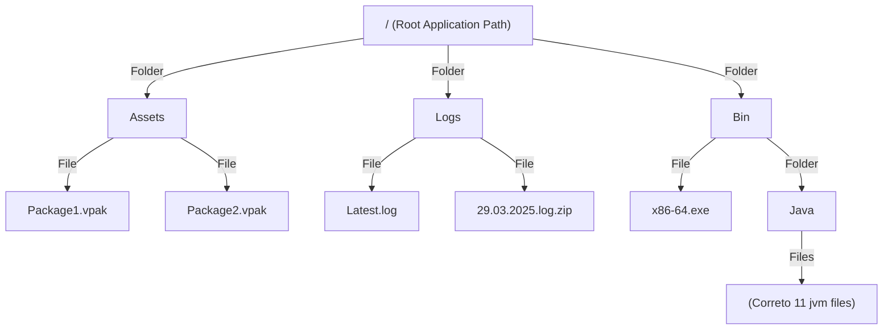

# Main filesystem

```mermaid
graph TD;
    Root["/ (Root Application Path)"]
    
    Root -->|Folder| Assets["Assets"]
    Assets -->|File| Package1["Package1.vpak"]
    Assets -->|File| Package2["Package2.vpak"]

    Root -->|Folder| Logs["Logs"]
    Logs -->|File| LatestLog["Latest.log"]
    Logs -->|File| OldLog["29.03.2025.log.zip"]

    Root -->|Folder| Bin["Bin"]
    Bin -->|File| Exe["x86-64.exe"]
    Bin -->|Folder| Java["Java"]
    Java -->|Files| JVM["(Correto 11 jvm files)"]

```

Assets folder contains compressed files in **VPAK** (V-Package) format. [Learn more]()